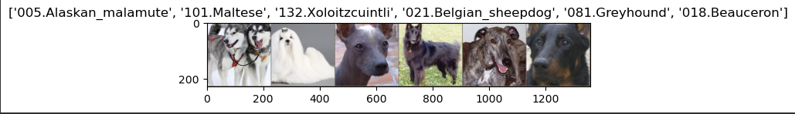
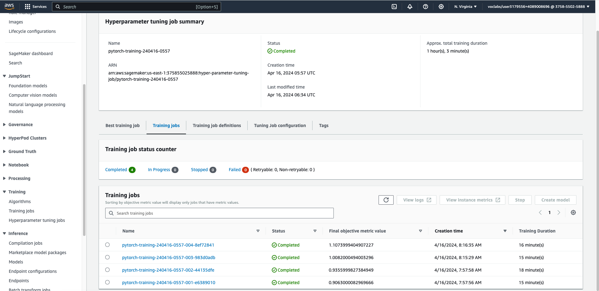
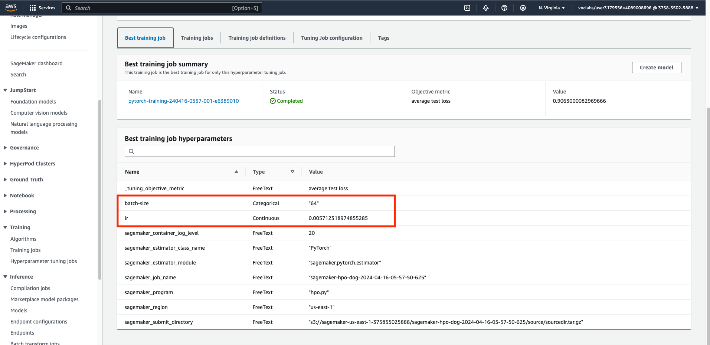
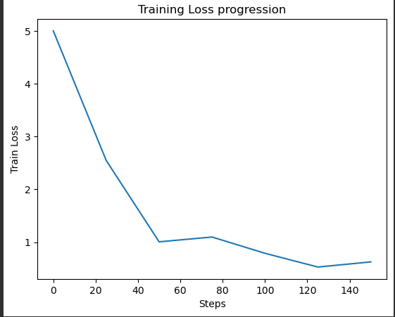
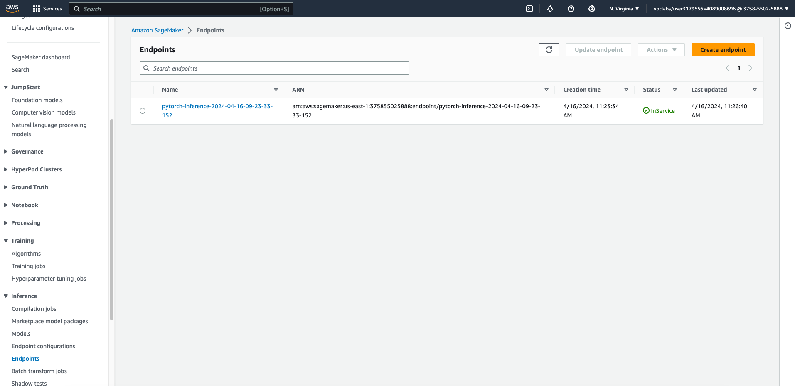

# Image Classification using AWS SageMaker

Use AWS Sagemaker to train a pretrained model that can perform image classification by using the Sagemaker profiling, 
debugger, hyperparameter tuning and other good ML engineering practices. This can be done on either the provided 
dog breed classication data set or one of your choice.

## Dog Classification
For this project we will use images of dogs to predict their respective dog breed. 
The data contains out of a pictures of a dog with it's corresponding dog breed. 
Using Deeplearning we will build a classifier capable of predicting the dog breed of a given dogs picture.

Below some examples of dog images with their dogbreed.

## Project Set Up and Installation
Enter AWS through the gateway in the course and open SageMaker Studio. 
Download the starter files.
Download/Make the dataset available. 

## Dataset
The provided dataset is the dogbreed classification dataset which can be found in the classroom.
The project is designed to be dataset independent so if there is a dataset that is more interesting or relevant to your 
work, you are welcome to use it to complete the project.

### Access
Upload the data to an S3 bucket through the AWS Gateway so that SageMaker has access to the data. 

## Hyperparameter Tuning
For this task, I've chosen to utilize ResNet-18 and transfer learning. ResNet-18 is a pre-trained convolutional 
neural network architecture that has undergone training on a substantial dataset, such as ImageNet, containing 
millions of images. Through this pre-training process, ResNet-18 has acquired general features and patterns from a 
diverse array of images, including those that can be relevant to dog classification tasks. By leveraging a 
pre-trained model, we not only save time and computational resources but also tap into the extensive pattern recognition 
gained during its training on ImageNet. This may prove beneficial for specific tasks like dog classification.

I've chosen ResNet-18 to optimize resource usage within the constraints of the AWS subscription and because it is 
powerful enough to achieve satisfactory results and demonstrate the advantages of transfer learning.
Other options I would explore as an extension to this project are ResNet32, -ResNet-50, ResNet-101, ResNet-152. 
(Ref: https://lekhuyen.medium.com/a-quick-overview-of-resnet-models-f8ed277ae81e)

**The parameters for the model include the learning rate and the batch size.**

#### Motivation for learning rate:

The learning rate determines the size of the steps taken during the optimization process (e.g., gradient descent) 
to update the model parameters. A learning rate that is too high may cause the optimization algorithm to overshoot the 
optimal solution, leading to instability or divergence. On the other hand, a learning rate that is too low may result in 
slow convergence or getting stuck in local minima. 

#### Motivation for batch size:

The batch size specifies the number of samples processed by the model in each iteration during training. The choice of 
batch size affects the trade-off between computation efficiency and model generalization. Larger batch sizes generally 
lead to faster training due to parallelization and GPU utilization but may result in lower generalization performance. 
Smaller batch sizes, on the other hand, introduce more noise into the optimization process but may lead to better 
generalization. 

#### Hyperparameter ranges:

    hyperparameter_ranges = {
        "lr": ContinuousParameter(0.001, 0.01),
        "batch-size": CategoricalParameter([32, 64, 128]),
    }

### Completed training Jobs

### Log metrics during the training process

    objective_metric_name = "average test loss"
    objective_type = "Minimize"
    metric_definitions = [{"Name": "average test loss", "Regex": "Test set: Average loss: ([0-9\\.]+)"}]

### Training job with best performing hyperparameters

## Debugging and Profiling

For setting up debugging and profiling I needed to make some changes to the train_model.py script.
The steps are also explained in the "SageMaker Debugger & Profiler" lesson. 
1. Import Amazon SageMaker Debugger client library
2. When training, add the SMDebug hook for PyTorch with TRAIN mode.
3. When testing/validation, add the SMDebug hook for PyTorch with EVAL mode.
4. In the main() function, create the SMDebug hook and register to the model.
5. in the main() function), pass the hook to the function for training/testing in the epoch loop. 
6. Configure Debugger Rules and Hook Parameters

rules, debugger_hook_config and profiler_config:

    #https://aws.amazon.com/blogs/machine-learning/detecting-hidden-but-non-trivial-problems-in-transfer-learning-models-using-amazon-sagemaker-debugger/
    from sagemaker.debugger import Rule, DebuggerHookConfig, rule_configs, ProfilerRule, CollectionConfig, ProfilerConfig, FrameworkProfile
    loss_not_decreasing_rule = Rule.sagemaker(base_config=rule_configs.loss_not_decreasing(),
                                 rule_parameters={"tensor_regex": "CrossEntropyLoss_output_0", "mode": "TRAIN"})
    
    rules = [loss_not_decreasing_rule,
        Rule.sagemaker(rule_configs.vanishing_gradient()),
        Rule.sagemaker(rule_configs.overfit()),
        Rule.sagemaker(rule_configs.overtraining()),
        Rule.sagemaker(rule_configs.poor_weight_initialization()),
        ProfilerRule.sagemaker(rule_configs.ProfilerReport()),
    ]
    
    debugger_hook_config = DebuggerHookConfig(
          collection_configs=[ 
              CollectionConfig(
                    name="custom_collection",
                    parameters={ "include_regex": ".*ReLU_output|.*ResNet_input|.*image|.*CrossEntropyLoss",
                                 "train.save_interval": "25",
                                 "eval.save_interval": "25" })])
    
    profiler_config = ProfilerConfig(
        system_monitor_interval_millis=500, framework_profile_params=FrameworkProfile(num_steps=10)
    )

Add rules, debugger_hook_config and profiler_config to estimator (Script-mode):

    estimator = PyTorch(
        entry_point="train_model.py",
        base_job_name="sagemaker-dbpr-dog",
        role=get_execution_role(),
        hyperparameters=best_hyperparameters,
        instance_count=1,
        instance_type="ml.m5.large",
        framework_version="1.8",
        py_version="py36",
        ## Debugger parameters
        rules=rules,
        debugger_hook_config=debugger_hook_config,
        profiler_config=profiler_config,
    )

### Results
Train Loss progression:

There is a decreasing trend in the loss as part of training (Chart). For this instance it was however not consistent, 
and it would be worth checking if it could not be an issue. See also message (LossNotDecreasing: IssuesFound) part of 
the training job.I found out that rerunning the script, the loss was consistent decreasing (chart) so there is also 
element of randomization at play of the weights of the network.  

From the report there is also no utilisation of GPUs. As a next step or improvement of this project I would
check the recommendation and try for larger batch sizes. Testing larger batch sizes not limited to 128 like 
set in this project.

There was also 3 times an event triggered for step outlier. I would review the instance_types and potentially decide for 
a more powerfull instance_type then ml.m5.large. It could also be solved first by addressing the previous point and 
let the model training benefit of the use of GPUs. 

StepOutlier:
"The step duration for forward and backward pass should be roughly the same throughout the training. 
If there are significant outliers, it may indicate a system stall or bottleneck issues."

The profiler/debugger report can be found under: profiler-report.pdf

## Model Deployment
As part of model deployment to an endpoint, I created an inference script. 
The script contains the required and some optional function. 
- model_fn(model_dir) -- Load saved model from file
- input_fn(request_body, content_type) -- Loading and preprocessing the input file for prediction
- predict_fn(input_object, model) -- Performing the prediction for the input 
- output_fn(predictions, content_type) -- Convert predictions to JSON-serializable format

The endpoint has been created using:

    from sagemaker.pytorch import PyTorchModel
    jpeg_serializer = sagemaker.serializers.IdentitySerializer("image/jpeg")
    json_deserializer = sagemaker.deserializers.JSONDeserializer()
    
    # Create a PyTorchModel object
    pytorch_model = PyTorchModel(
        model_data=estimator.model_data,
        role=get_execution_role(),
        entry_point='inference.py',  # Path to your PyTorch inference script
        framework_version='1.8.1',     # PyTorch version
        py_version="py36",
    )
    
    # Deploy to endpoint
    predictor = pytorch_model.deploy(
        instance_type='ml.m5.large',
        initial_instance_count=1,
        serializer=jpeg_serializer,
        deserializer=json_deserializer
    )

Predicting for an example:

    from PIL import Image
    import io
    
    # Open the image
    image = Image.open("dogImages/test/020.Belgian_malinois/Belgian_malinois_01460.jpg")
    
    # Create an in-memory byte buffer
    image_bytes = io.BytesIO()
    
    # Save the image to the byte buffer in JPEG format
    image.save(image_bytes, format='JPEG')
    
    # Get the bytes from the byte buffer
    image_bytes.seek(0)
    image = image_bytes.read()

Calling the predictor:

    # The prediction should be matching the dogbreed subdirectory (label) in the test directory. e.g. 020.Belgian_malinois for Belgain Malinois images
    import numpy as np
    
    response = predictor.predict(image, initial_args={'ContentType': 'image/jpeg'})
    print(class_names[np.argmax(response, 1)[0]])
    
    -----> 020.Belgian_malinois
