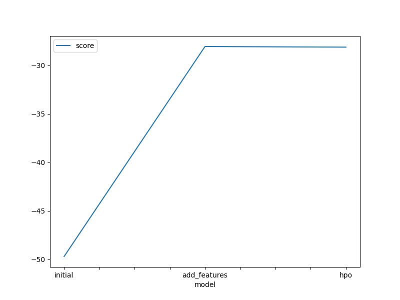

# Report: Predict Bike Sharing Demand with AutoGluon Solution
#### Kurt Kuppens

## Initial Training
### What did you realize when you tried to submit your predictions? What changes were needed to the output of the predictor to submit your results?
I did not need to change anything for submitting to the competition. I did not get any negative values. 
What I personally would change if I made this for a customer, is the rounding of numerical values to natural numbers 
as we are talking about count of bikes. 

### What was the top ranked model that performed?
The top ranked model was an ensemble model -> WeightedEnsemble_L3.

#### Model Ensemble weights and models:

Ensemble Weights: {'NeuralNetFastAI_r191_BAG_L2': 0.494, 'RandomForestMSE_BAG_L2': 0.221, 
'NeuralNetTorch_r79_BAG_L2': 0.195, 'NeuralNetTorch_BAG_L2': 0.078, 'ExtraTreesMSE_BAG_L2': 0.013}

	-49.7061	 = Validation score   (-root_mean_squared_error)

## Exploratory data analysis and feature creation
### What did the exploratory analysis find and how did you add additional features?
From exploratory analysis we can see that most records are for working days and a non-holiday. 
Bike demand records seems to be a more or less even distributed over the seasons. 
Bike demand is higher around a temperature of 20 and mainly for when the weather is of category:

- 1: Clear, Few clouds, Partly cloudy, Partly cloudy
- 2: Mist + Cloudy, Mist + Broken clouds, Mist + Few clouds, Mist

The Health and Safety Executive recommends that relative humidity indoors should be maintained at 40-70%.
Looking at the data this seems to be similar for bike demands with a 25th percentile of 47 and a 75 percentile of 77. 
As expected there is also lesser of demands for bikes when there will be too much wind. 
From a wind speed of 25 it's starts to tail off.  

The extra feature has been created by extracting the hour of the datetime field.

    train['hour'] = train['datetime'].dt.hour
    test['hour'] = test['datetime'].dt.hour

### How much better did your model preform after adding additional features and why do you think that is?
The score improved by a little more than 1 point from 1.83721 to 0.83227. 
We have been provided with hourly rental data spanning 2 years. Extracting the hour from the provided datetime
gives from what I believe more information value as part of our prediction.  

## Hyper parameter tuning
### How much better did your model preform after trying different hyper parameters?
After hyperparameters optimization the score improved a little from 0.83227 to 0.82871.

These results have been obtained by tweaking AutoGluon higher level parameters:
num_bag_folds, num_bag_sets, num_stack_levels; 

Tested values:

- num_bag_folds; between 5 and 10
- num_bag_sets; between 1 and 20
- num_stack_levels; between 0 and 3

Below a description with in bold motivation (maximizing predictive performance) for selecting 
these for hyperparameter optimization. 

### num_bag_folds
- This parameter controls the number of folds used for bagging of models.
- Bagging is a technique where multiple models are trained on different subsets 
of the training data and their predictions are combined to make the final prediction.
- It's recommended to set num_bag_folds between 5 and 10 to **maximize predictive performance**.

### num_bag_sets
- This parameter controls the number of repeats of k-fold bagging to perform.
- Higher values of num_bag_sets typically result in **superior predictive performance**, especially on smaller problems and when stacking is enabled (which reduces overall variance).

### num_stack_levels
- This parameter controls the number of stacking levels to use in stack ensemble.
- Stacking is an ensemble learning technique where multiple models are combined by training a meta-model on their predictions.
- It's recommended to set num_stack_levels between 1 and 3 to **maximize predictive performance**.

I also tried to optimize an individual model XGBoost (details in notebook). 
Note: I did not achieve satisfying results (evaluation metric) with chosen hyperparameters and values and did not 
submit for kaggle scoring.  

### If you were given more time with this dataset, where do you think you would spend more time?
I would spend more time on data exploratory and adding features. In addition to the hour I would try additional features
like adding month, day... Maybe add some time periods, if possible after discussion with people who rent bikes, 
like morning, afternoon.     

### Create a table with the models you ran, the hyperparameters modified, and the kaggle score.
|model| hpo1            | hpo2            | hpo3            | score    |
|--|-----------------|-----------------|-----------------|----------|
|initial| default values  | default values  | default values  | 1.83721  |
|add_features| default values | default values | default values | 0.83227 |
|hpo| num_bag_folds=9              | num_bag_sets=15             | num_stack_levels=3              | 0.82871       |

### Create a line plot showing the top model score for the three (or more) training runs during the project.

### Create a line plot showing the top kaggle score for the three (or more) prediction submissions during the project.

## Summary
In this project we had the change to look at data related to bike demands. 
Starting with an exploratory data analysis we look at some characteristics of the data features and 
decide how we could improve further the power of predicting demands by adding additional features and tuning 
hyperparameters of the models/AutoGluon.
What I learned is that models with even better validation score as part of training performing worse on the test data 
from kaggle. The opposite also being true for the model that performed best on the kaggle competition 
after hyperparameter tuning with slightly worse validation score compared to the one with added feature. 
Given more time I would not spend too much time, for this case, on hyperparameter tuning. I would focus on adding 
additional features and trying some more transformations like one-hot encoding for some of the categorical features.   
